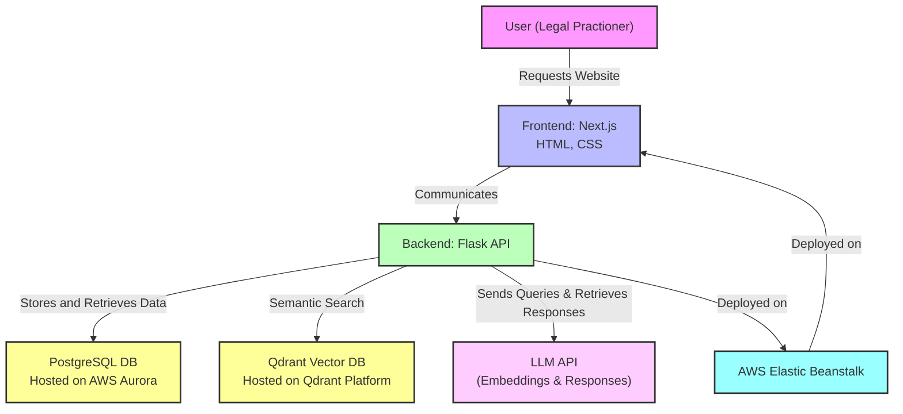

```mermaid
flowchart TD
    %% Frontend
    User["User (Legal Practioner)"] -->|Requests Website| NextJS["Frontend: Next.js<br>HTML, CSS"]
    NextJS -->|Communicates| Flask["Backend: Flask API"]

    %% Backend and Databases
    Flask -->|Stores and Retrieves Data| Aurora["PostgreSQL DB<br>Hosted on AWS Aurora"]
    Flask -->|Semantic Search| Qdrant["Qdrant Vector DB<br>Hosted on Qdrant Platform"]
    Flask -->|Sends Queries & Retrieves Responses| LLM["LLM API<br>(Embeddings & Responses)"]

    %% Hosting
    Flask -->|Deployed on| Beanstalk["AWS Elastic Beanstalk"]

    %% AWS Hosting
    Beanstalk -->|Deployed on| NextJS

    %% Legend
    style User fill:#f9f,stroke:#333,stroke-width:2px
    style NextJS fill:#bbf,stroke:#333,stroke-width:2px
    style Flask fill:#bfb,stroke:#333,stroke-width:2px
    style Aurora fill:#ff9,stroke:#333,stroke-width:2px
    style Qdrant fill:#ff9,stroke:#333,stroke-width:2px
    style LLM fill:#fcf,stroke:#333,stroke-width:2px
    style Beanstalk fill:#9ff,stroke:#333,stroke-width:2px

```