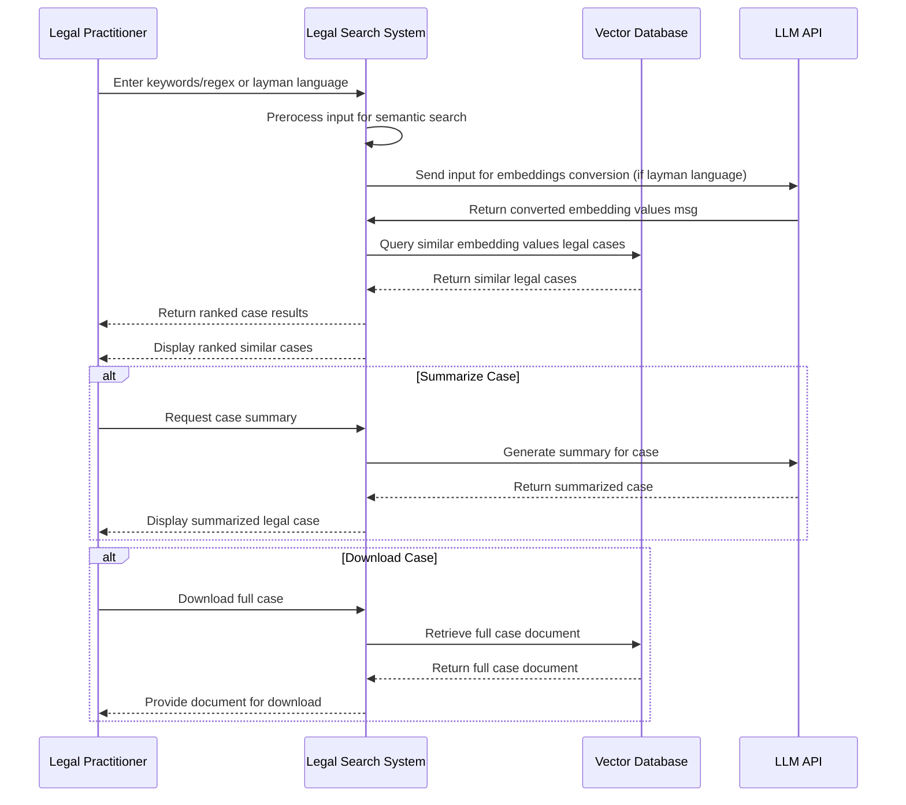

```mermaid
sequenceDiagram
  participant User as Legal Practitioner
  participant System as Legal Search System
  participant DB as Vector Database
  participant LLM as LLM API

  User ->> System: Enter keywords/regex or layman language
  System ->> System: Prerocess input for semantic search
  System ->> LLM: Send input for embeddings conversion (if layman language)
  LLM ->> System: Return converted embedding values msg
  System ->> DB: Query similar embedding values legal cases
  DB -->> System: Return similar legal cases
  System -->> User: Return ranked case results
  System -->> User: Display ranked similar cases
  alt Summarize Case
    User ->> System: Request case summary
    System ->> LLM: Generate summary for case
    LLM -->> System: Return summarized case
    System -->> User: Display summarized legal case
  end
  alt Download Case
    User ->> System: Download full case
    System ->> DB: Retrieve full case document
    DB -->> System: Return full case document
    System -->> User: Provide document for download
  end
```
