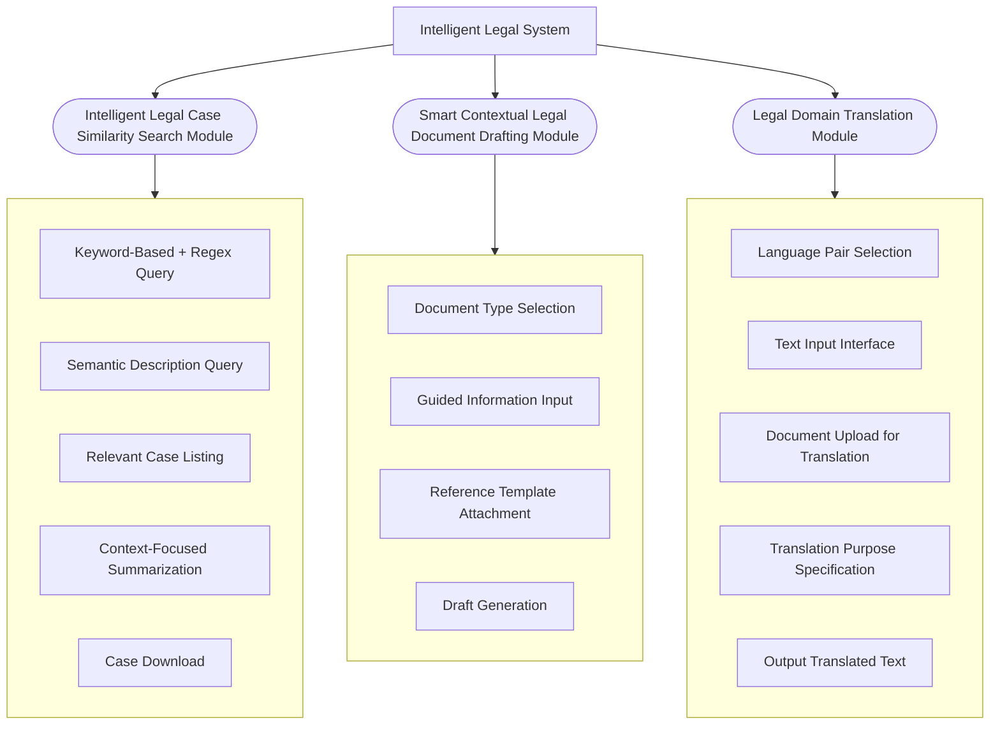

```mermaid
flowchart TB
    %% Main System
    LLMSystem["Intelligent Legal System"]
    ILCS(["Intelligent Legal Case Similarity Search Module"])
    SCLD(["Smart Contextual Legal Document Drafting Module"])
    LDT(["Legal Domain Translation Module"])

    %% Intelligent Legal Case Similarity Search Module
    subgraph ILCSSG[" "]
        ILCS1["Keyword-Based + Regex Query"]
        ILCS2["Semantic Description Query"]
        ILCS3["Relevant Case Listing"]
        ILCS4["Context-Focused Summarization"]
        ILCS5["Case Download"]
    end

    %% Smart Contextual Legal Document Drafting Module
    subgraph SCLDSG[" "]
        SCLD1["Document Type Selection"]
        SCLD2["Guided Information Input"]
        SCLD3["Reference Template Attachment"]
        SCLD4["Draft Generation"]
    end

    %% Legal Domain Translation Module
    subgraph LDTSG[" "]
        LDT1["Language Pair Selection"]
        LDT2["Text Input Interface"]
        LDT3["Document Upload for Translation"]
        LDT4["Translation Purpose Specification"]
        LDT5["Output Translated Text"]
    end

    %% Connections
    LLMSystem --> ILCS
    LLMSystem --> SCLD
    LLMSystem --> LDT
    ILCS --> ILCSSG
    SCLD --> SCLDSG
    LDT --> LDTSG
```