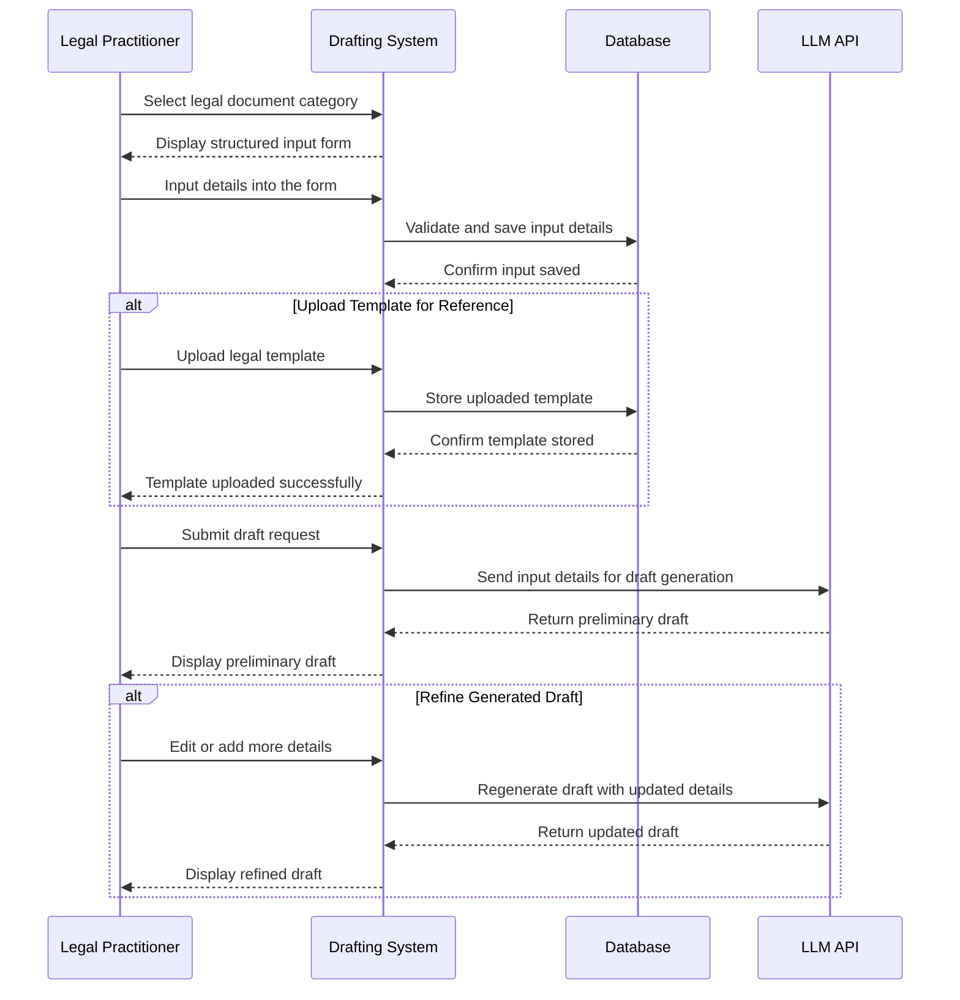

```mermaid
sequenceDiagram
    participant User as Legal Practitioner
    participant System as Drafting System
    participant DB as Database
    participant LLM as LLM API

    User ->> System: Select legal document category
    System -->> User: Display structured input form
    User ->> System: Input details into the form
    System ->> DB: Validate and save input details
    DB -->> System: Confirm input saved

    alt Upload Template for Reference
        User ->> System: Upload legal template
        System ->> DB: Store uploaded template
        DB -->> System: Confirm template stored
        System -->> User: Template uploaded successfully
    end

    User ->> System: Submit draft request
    System ->> LLM: Send input details for draft generation
    LLM -->> System: Return preliminary draft
    System -->> User: Display preliminary draft

    alt Refine Generated Draft
        User ->> System: Edit or add more details
        System ->> LLM: Regenerate draft with updated details
        LLM -->> System: Return updated draft
        System -->> User: Display refined draft
    end
```
